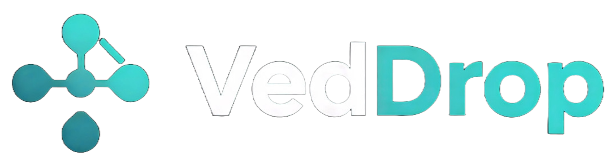
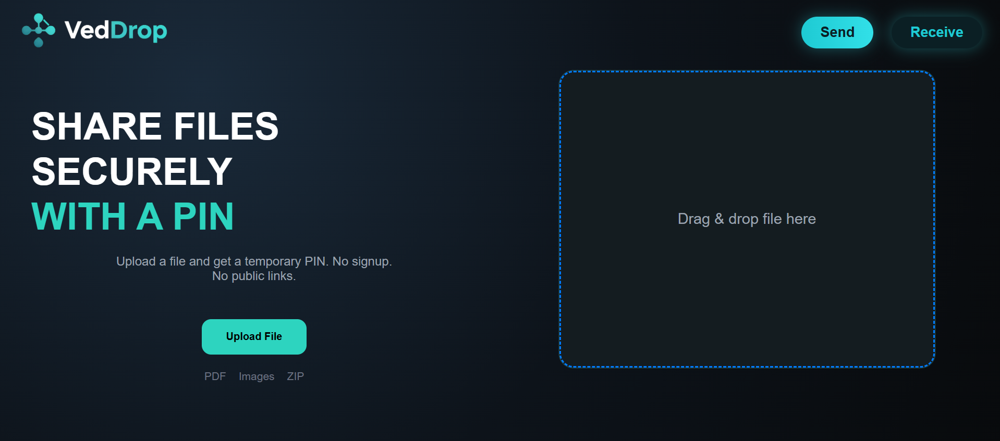

#  VedDrop - Secure File Sharing

[](https://veddrop.netlify.app)


**VedDrop** is a privacy-focused web application designed for fast, temporary file transfers using a secure PIN system. No signups, no permanent links, and no data footprint.

[**Launch VedDrop App**](https://veddrop.netlify.app/)

---

## 📸 Preview
<p align="center">
  
</p>

## ✨ Core Features
- **PIN-Protected Access**: Files are only accessible via a 6-digit PIN you provide to the receiver.
- **Auto-Expiry**: To ensure security, shared files automatically delete after 10 minutes.
- **No Account Needed**: Instant "Drop and Go" functionality—no registration required.
- **Privacy First**: Files are never publicly indexed or shared outside of your PIN.

## 🛠️ Technical Implementation
- **Frontend**: React.js with Vite for high-speed performance.
- **State Management**: React Hooks.
- **Accessibility**: Optimized with ARIA labels and semantic HTML.
- **SEO**: Fully configured with JSON-LD WebApplication schema for Google indexing.

## 🚀 Installation & Local Development

1. **Clone the repository**
   ```bash
   git clone [https://github.com/NabinCenth/VedDrop-Client.git](https://github.com/NabinCenth/VedDrop-Client.git)
Install dependencies

Bash

cd VedDrop-Client
npm install
Run the development server

Bash

npm run dev
🛡️ Security & Privacy
VedDrop is built to solve the problem of "temporary sharing." Unlike cloud storage (Drive/Dropbox), VedDrop is designed for one-time transfers where you don't want the file to exist on the internet forever.

👤 Author
Nabin Pokharel

Website: bedprasadpokharel.com.np

GitHub: @NabinCenth

<p align="center"> Built with ❤️ for secure sharing. </p>
